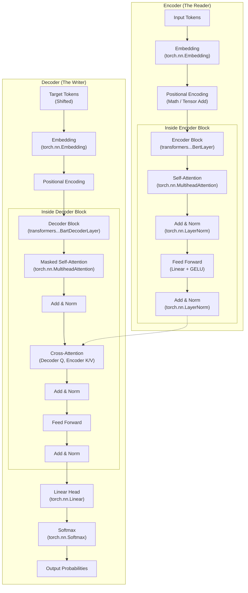
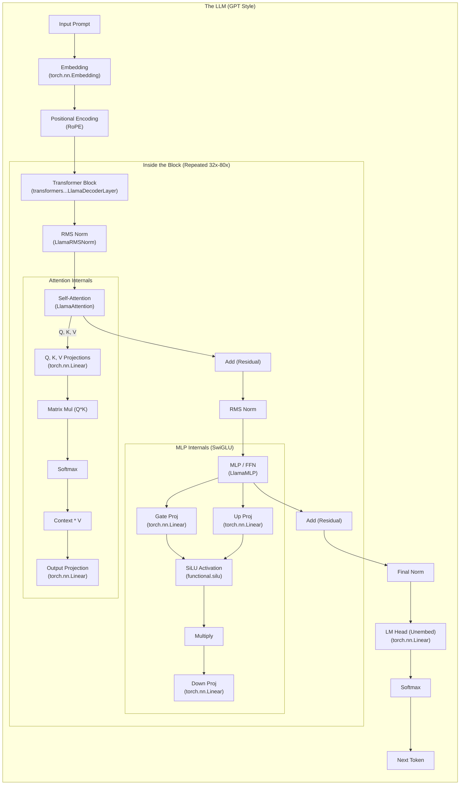

# Transformer Architecture & Tool Mapping

## 1. Original Encoder-Decoder (The "Translator")

*As proposed in "Attention Is All You Need" (2017). Used for translation (English -> French).*

---

## 2. Decoder-Only (The "Predictor")

*The standard for modern LLMs (GPT-3, Llama, Mistral). It just predicts the next token.*

## 🔑 Key Differences for Engineers

| Feature | Encoder-Decoder (Original) | Decoder-Only (GPT/Llama) |
| :--- | :--- | :--- |
| **Primary Use** | Translation (Seq2Seq) | Text Generation (Next Token Prediction) |
| **Attention** | Has **Cross-Attention** (Decoder looks at Encoder) | **Self-Attention Only** (Looks at past tokens) |
| **Complexity** | 2 Stacks (Encoder + Decoder) | 1 Stack (Decoder) |
| **Library Class** | `BartModel`, `T5Model` | `LlamaForCausalLM`, `GPT2LMHeadModel` |
| **KV Cache** | Caches Decoder states only | Caches **everything** (since everything is decoder) |
